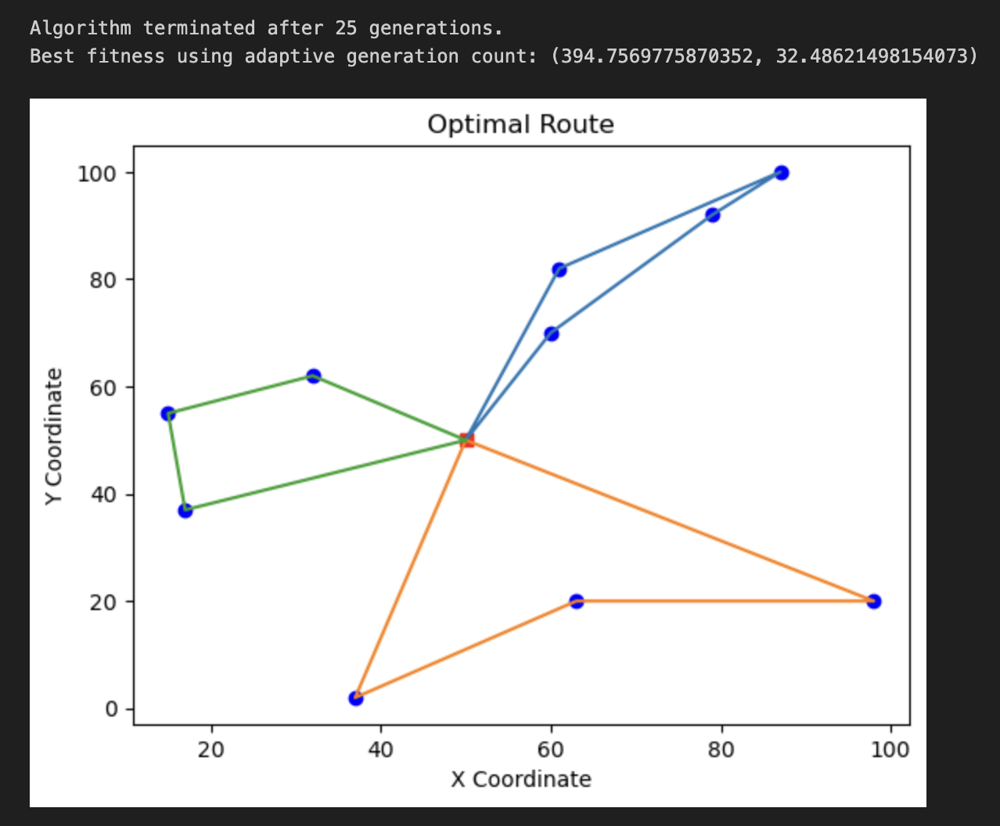

# DarwinDispatch
## 🚀 Overview
GenetiCargo is a **Vehicle Routing Problem (VRP) solver** that leverages **Genetic Algorithms (GA)** to optimize delivery routes for multiple vehicles. By balancing **total travel distance** and **route fairness**, this project provides an adaptive approach to real-world logistics challenges.

## 🏆 Features
- 📌 **Multi-Vehicle Route Optimization**: Efficiently assigns delivery points to vehicles.
- 🧠 **Genetic Algorithm-Based Optimization**: Utilizes evolutionary principles for solving VRP.
- 📊 **Multi-Objective Fitness Function**: Minimizes total travel distance while balancing vehicle workloads.
- 📈 **Adaptive Termination Strategy**: Stops optimization when improvements stagnate.
- 📍 **Visual Route Plotting**: Displays optimized routes with Matplotlib.

## 🔧 Installation
1. Clone the repository:
   ```bash
   git clone https://github.com/Tarunbhati100/DarwinDispatch.git
   cd GenetiCargo
   ```
2. Install dependencies:
   ```bash
   pip install -r requirements.txt
   ```

## 📜 Usage
Run the algorithm with:
```bash
python main.py
```

## 📌 Example Output
The algorithm optimizes routes for **10 delivery locations** using **3 vehicles**, starting and ending at a central depot. After execution, an optimal route visualization is generated.

## ⚙️ How It Works
1. **Initial Population**: Generates a set of possible delivery sequences.
2. **Fitness Evaluation**: Scores each sequence based on distance and workload balance.
3. **Selection, Crossover & Mutation**: Uses **Tournament Selection**, **Partially Matched Crossover (PMX)**, and **Mutation** to evolve better routes.
4. **Termination**: Stops after **300 generations** or **stagnation for 20 generations**.
5. **Visualization**: The best solution is plotted, showing optimal routes.

## 📊 Algorithm Workflow
- **Chromosome Representation**: Each individual represents an ordered list of locations.
- **Fitness Function**: Evaluates the total distance and workload balance.
- **Genetic Operators**:
  - **Selection**: Tournament-based selection.
  - **Crossover**: Partially Matched Crossover (PMX) for maintaining valid sequences.
  - **Mutation**: Index shuffling with a 5% probability.

## 📷 Sample Visualization



## 🛠 Dependencies
- `numpy`
- `matplotlib`
- `deap`
- `random`

